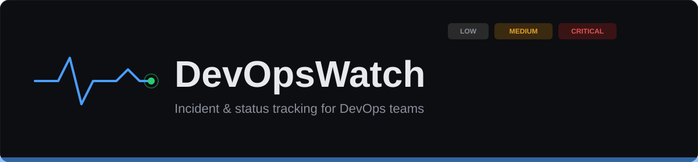


DevOpsWatch is a self-hosted incident and status tracker built as a capstone project. Teams can log in, track incidents through their lifecycle, and write postmortem timelines — while CloudWatch alarms can automatically create incidents on the dashboard the moment something breaks, with zero manual steps.

The entire system — VPC, EC2, IAM, CloudWatch, SNS, Lambda — is defined in Terraform and deployed automatically through GitHub Actions. A single click deploys the full application to a fresh, publicly reachable server.

## Table of Contents

- [Features](#features)
- [Architecture](#architecture)
- [Screenshots](#screenshots)
- [Tech Stack](#tech-stack)
- [Prerequisites](#prerequisites)
- [Local Development](#local-development)
- [Cloud Deployment](#cloud-deployment)
- [CI/CD Pipeline](#cicd-pipeline)
- [Automated Incident Creation](#automated-incident-creation)
- [API Overview](#api-overview)
- [Known Limitations & Future Improvements](#known-limitations--future-improvements)
- [Contributing](#contributing)

## Features

- **JWT authentication** — register, log in, session persists across page refresh
- **Incident tracking** — create, update status (open / in progress / closed), filter by severity
- **Postmortem timelines** — add timestamped updates to any incident's history
- **Public status page** — no login required, auto-refreshes, honestly reports "unable to reach service" if the backend or database is down rather than showing stale data
- **Automated incident creation** — CloudWatch alarms (CPU at three severity tiers, instance health, custom database-connection-failure metric) trigger SNS, which fans out to email and a Lambda function that logs in as a service account and creates the incident via the API
- **Infrastructure as code** — the entire AWS stack (VPC, subnets, security group, EC2, IAM role, CloudWatch alarms, SNS, Lambda) is defined in Terraform, with state stored remotely in S3
- **One-click deployment** — GitHub Actions runs `terraform apply` on demand; a self-configuring EC2 instance installs Docker, clones the repo, and starts the app automatically — no SSH required
- **Fully containerized local development** — one `docker compose up` runs the database, backend, and frontend together

## Architecture

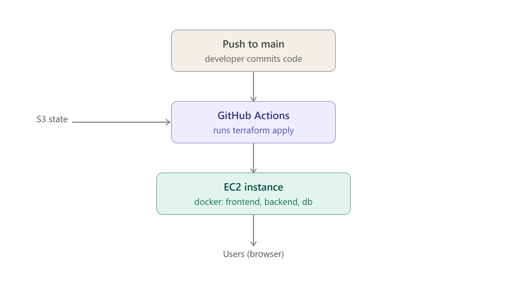

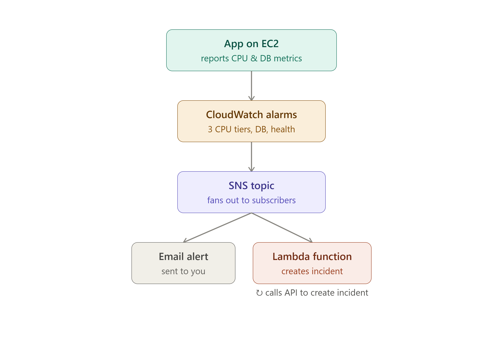

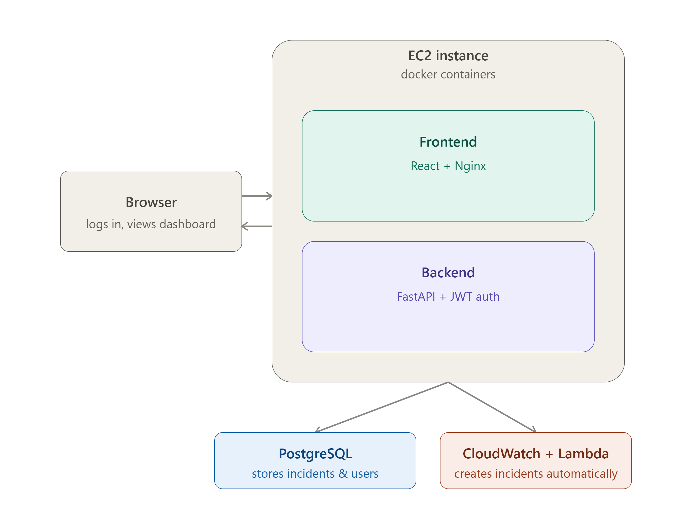


## Screenshots

### API & access

**Swagger API docs** — `/docs`, `POST /login` and `POST /incidents` expanded

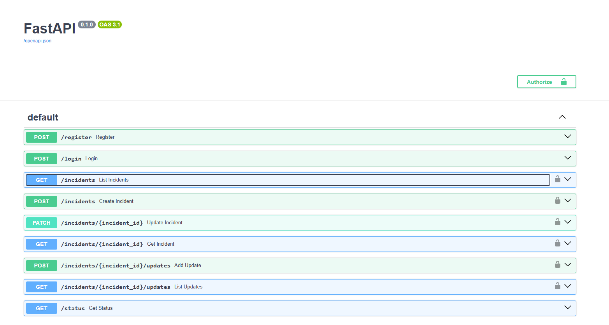


**Registration page** — `/register`

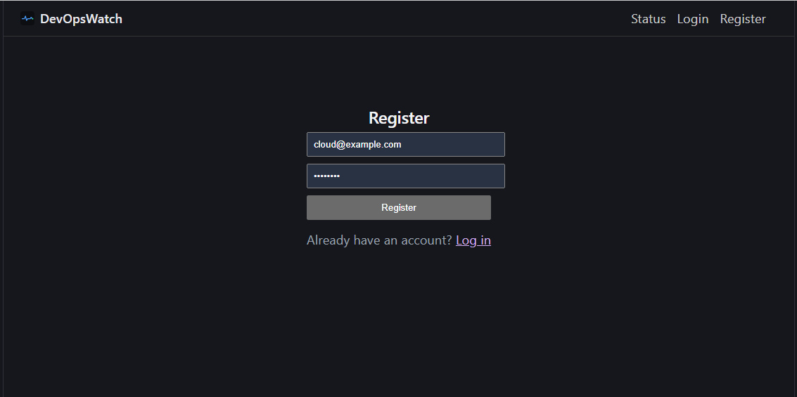


### Public status page

**Status page — All Systems Operational**

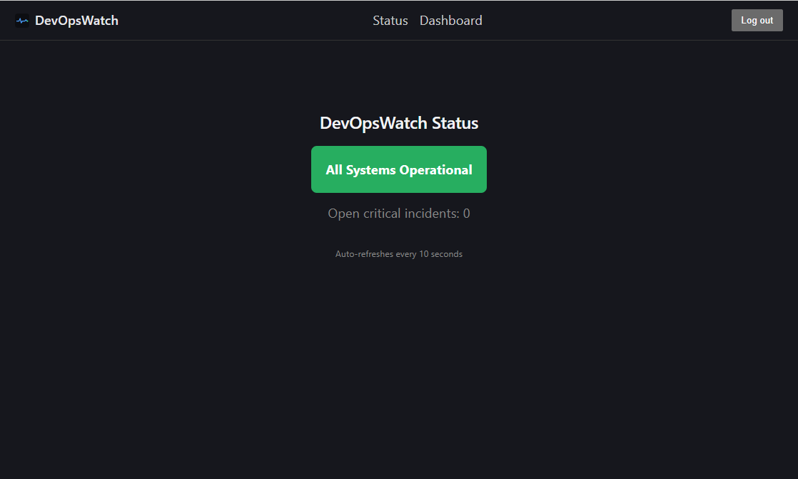


**Status page — Service Disruption** (open critical incident)

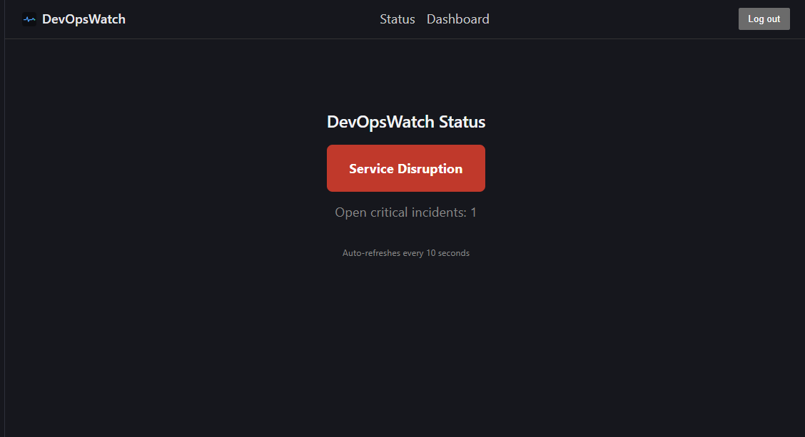


### Dashboard

**Dashboard — DB-connection incident auto-created**

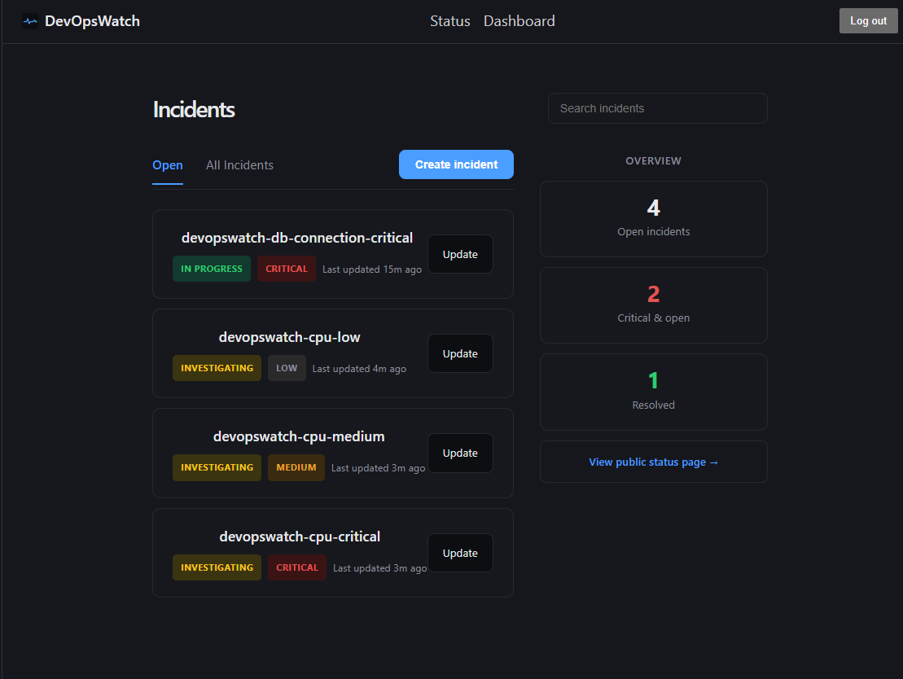


**Dashboard — full mix of incidents** (all severities, live automation results)

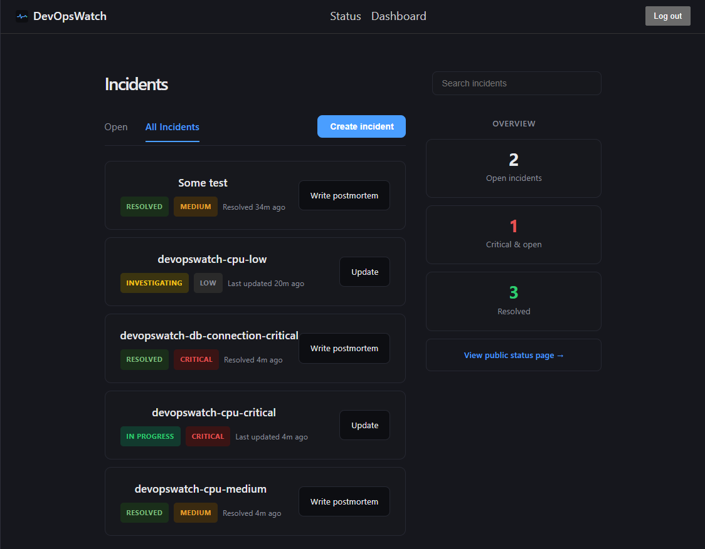


**Dashboard — with resolved incidents** (showing the "Resolved" counter and "Write postmortem" flow)

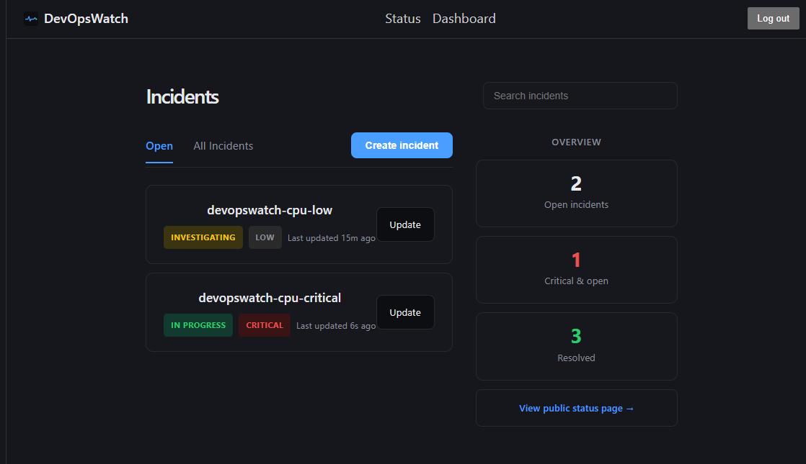


**Incident detail page — postmortem timeline**

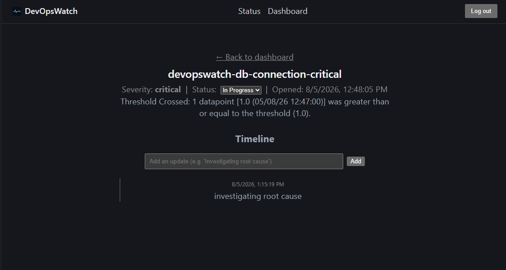


### Proof of automation (CloudWatch → SNS → Lambda)

**CloudWatch alarm in ALARM state**

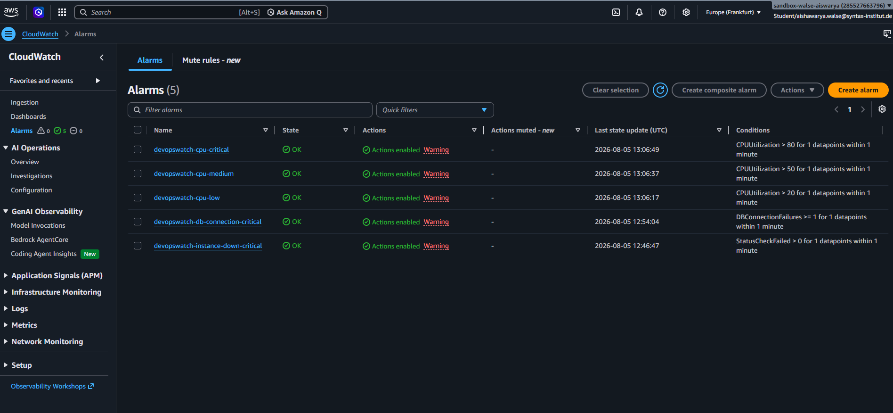


**SNS email notification** — the actual alert that arrived

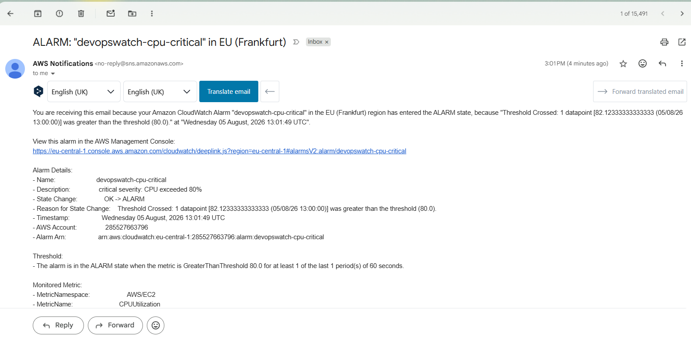


**Lambda logs — successful incident creation**

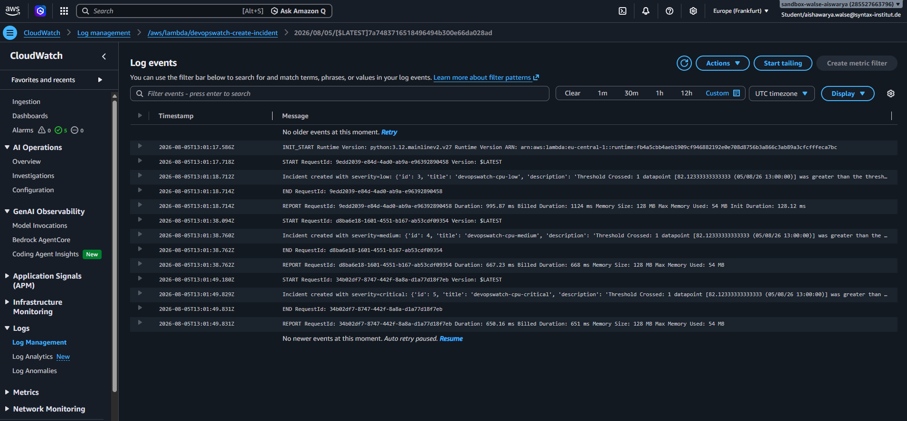


## Tech Stack

| Layer | Technology |
|---|---|
| Frontend | React (Vite), React Router, Axios |
| Backend | FastAPI, SQLAlchemy, Pydantic, python-jose (JWT), passlib (bcrypt) |
| Database | PostgreSQL |
| Infrastructure | Terraform (AWS provider), S3 remote state |
| Compute | AWS EC2 (self-configuring via `user_data`) |
| Automation | AWS CloudWatch, SNS, Lambda, IAM |
| CI/CD | GitHub Actions |
| Containerization | Docker, Docker Compose |

## Prerequisites

- [Docker Desktop](https://www.docker.com/products/docker-desktop/) (for local development)
- [Git](https://git-scm.com/)
- An AWS account (for cloud deployment)
- [Terraform CLI](https://developer.hashicorp.com/terraform/downloads) (for manual cloud deployment; not required if you only use GitHub Actions)
- AWS CLI configured locally (`aws configure`) if deploying manually

## Local Development

1. **Clone the repository**
   ```bash
   git clone https://github.com/ashwal015/DevOpsWatch.git
   cd DevOpsWatch
   ```

2. **Create a `.env` file** in the project root (this file is git-ignored and must be created manually):
   ```env
   DATABASE_URL=postgresql://postgres:yourpassword@db/devopswatch
   DB_PASSWORD=yourpassword
   SECRET_KEY=your-random-secret-key
   ALLOWED_ORIGINS=http://localhost:3000,http://localhost:5173
   API_URL=http://localhost:8000
   ```
   `DATABASE_URL`'s password and `DB_PASSWORD` **must match exactly** — this is the single most common setup mistake (see [Known Limitations](#known-limitations--future-improvements)).

3. **Start everything**
   ```bash
   docker compose up --build -d
   ```

4. **Verify all three containers are running**, with `db` showing `(healthy)`:
   ```bash
   docker compose ps
   ```

5. **Open the app**
   - Frontend: [http://localhost:3000](http://localhost:3000)
   - Backend API docs: [http://localhost:8000/docs](http://localhost:8000/docs)

6. **Register an account** at `/register`, then log in.

## Cloud Deployment

DevOpsWatch deploys to a single EC2 instance that configures itself completely on first boot — no manual SSH setup required.

### Option A — GitHub Actions (recommended)

1. Add the following as **GitHub repository secrets** (Settings → Secrets and variables → Actions):

   | Secret | Description |
   |---|---|
   | `AWS_ACCESS_KEY_ID` | AWS access key |
   | `AWS_SECRET_ACCESS_KEY` | AWS secret key |
   | `ALERT_EMAIL` | Email to receive incident alerts |
   | `SERVICE_EMAIL` | Login for the Lambda service account |
   | `SERVICE_PASSWORD` | Password for the Lambda service account |
   | `DB_PASSWORD` | PostgreSQL password |
   | `JWT_SECRET_KEY` | JWT signing secret |

2. Go to the **Actions** tab → **Terraform Apply** → **Run workflow**.

3. Wait ~1–2 minutes for the workflow, then ~2 more minutes for the EC2 instance's `user_data` script to install Docker, clone the repo, and start the app.

4. Grab the instance's public IP from the workflow's **Show public IP** step, then visit `http://<ip>:3000`.

5. **Register the service account** at `http://<ip>:3000/register`, using the same email/password you put in the `SERVICE_EMAIL` / `SERVICE_PASSWORD` secrets — this is required for the automated incident pipeline to work (see below), and must be done fresh on every new deployment since each new instance starts with an empty database.

6. When finished testing, go to **Actions** → **Terraform Destroy** → **Run workflow** to tear everything down and stop AWS charges.

### Option B — Manual (local Terraform)

1. Create `Infra/terraform.tfvars` (git-ignored, never commit this file):
   ```hcl
   alert_email      = "you@example.com"
   service_email    = "service@example.com"
   service_password = "yourpassword"
   db_password      = "yourpassword"
   secret_key       = "your-random-secret-key"
   ```

2. ```bash
   cd Infra
   terraform init
   terraform apply
   ```

3. Follow steps 4–6 from Option A above.

## CI/CD Pipeline

Two GitHub Actions workflows manage the infrastructure:

- **`terraform-apply.yml`** — triggers automatically on any push touching `Infra/**`, or can be run manually. Configures AWS credentials from secrets, runs `terraform init` and `terraform apply -auto-approve`, and prints the resulting public IP.
- **`terraform-destroy.yml`** — **manual only** (`workflow_dispatch`), deliberately never triggered by a push, so infrastructure is never torn down by accident.

Terraform state is stored remotely in an S3 bucket rather than locally, so both a developer's laptop and GitHub Actions' runners always see the same, correct picture of what's deployed — critical for a shared/automated setup.

## Automated Incident Creation

CloudWatch alarms watch the EC2 instance and the application itself. When a threshold is crossed, the alarm publishes to an SNS topic, which fans out to two subscribers:

1. **Email** — a direct notification to whoever is subscribed
2. **Lambda function** — logs in as the service account, then calls the app's own `POST /incidents` API to create a real incident on the dashboard, with severity derived from the alarm's name

Configured alarms:

| Alarm | Trigger | Severity |
|---|---|---|
| `devopswatch-cpu-low` | CPU > 20% | Low |
| `devopswatch-cpu-medium` | CPU > 50% | Medium |
| `devopswatch-cpu-critical` | CPU > 80% | Critical |
| `devopswatch-instance-down-critical` | EC2 status check fails | Critical |
| `devopswatch-db-connection-critical` | Backend reports a database connection failure (custom metric) | Critical |

**Testing the pipeline without waiting for real load:**
```bash
aws cloudwatch put-metric-data --namespace "DevOpsWatch" --metric-name "DBConnectionFailures" --value 1
```
This safely triggers the custom database-failure alarm on demand. CPU alarms require genuine load — `AWS/EC2` is a reserved namespace that cannot be published to manually — and are best demonstrated with a real, short stress test on the instance:
```bash
ssh -i your-key.pem ubuntu@<ip>
sudo apt install -y stress
stress --cpu 2 --timeout 280
```

## API Overview

Full interactive documentation is available at `/docs` (Swagger UI) on any running instance. Key endpoints:

| Method | Endpoint | Auth required | Description |
|---|---|---|---|
| `POST` | `/register` | No | Create an account |
| `POST` | `/login` | No | Get a JWT access token |
| `GET` | `/incidents` | Yes | List incidents |
| `POST` | `/incidents` | Yes | Create an incident |
| `PATCH` | `/incidents/{id}` | Yes | Update an incident's status/severity |
| `GET` | `/incidents/{id}` | Yes | Get a single incident |
| `POST` | `/incidents/{id}/updates` | Yes | Add a postmortem timeline entry |
| `GET` | `/incidents/{id}/updates` | Yes | List an incident's timeline |
| `GET` | `/status` | No | Public system status (used by the status page) |

## Known Limitations & Future Improvements

- **Public IP changes on every redeploy.** Since the EC2 instance is destroyed and recreated rather than kept running, it receives a new public IP each time, which currently requires re-registering the service account. An Elastic IP or a domain name would remove this friction, at a small ongoing AWS cost.
- **The database-failure monitoring paradox.** If the database is genuinely down, CloudWatch can still receive the failure metric (a separate AWS service), but Lambda's attempt to *write* the resulting incident to the dashboard will itself fail, since that also needs the database. This mirrors a real, well-known limitation in production monitoring setups — tools like PagerDuty deliberately run on infrastructure entirely separate from what they monitor.
- **JWT stored in `localStorage`**, which is simple but readable by any JavaScript on the page. An `httpOnly` cookie set by the backend would be more secure and is a reasonable next step.
- **No automatic scaling or load balancing.** A single EC2 instance runs everything; an Auto Scaling Group behind an Application Load Balancer would add resilience at the cost of meaningfully more infrastructure complexity and a small ongoing cost.
- **Memory and disk-space alarms** were considered but require installing the CloudWatch Agent — deferred in favor of the zero-setup instance-health and custom database alarms.
- **Architecture diagrams could be generated automatically** as part of the CI/CD pipeline (e.g. via `terraform graph`) rather than built by hand — a reasonable next step if the project continues to evolve.

## Contributing

1. Create a branch for your change: `git checkout -b your-feature-name`
2. Test locally with `docker compose up --build -d` before pushing
3. Never commit `.env`, `terraform.tfvars`, or any `.pem` file — all are git-ignored by default
4. Open a Pull Request against `main`
